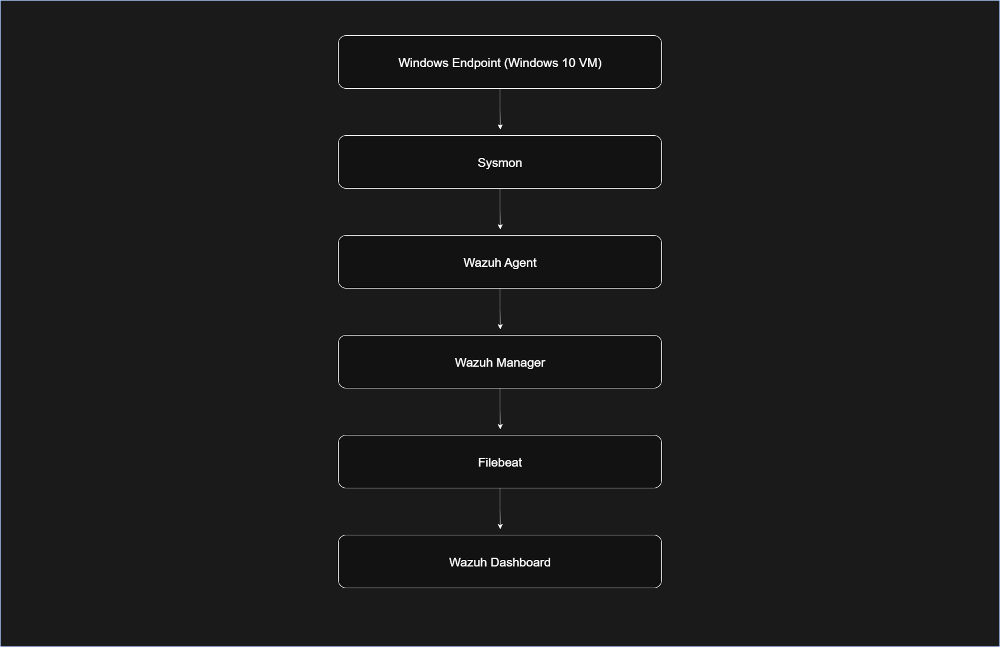
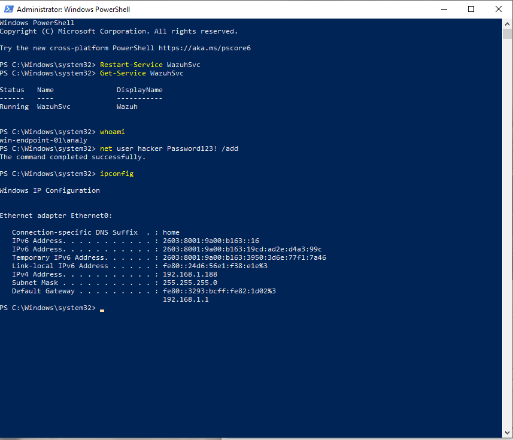
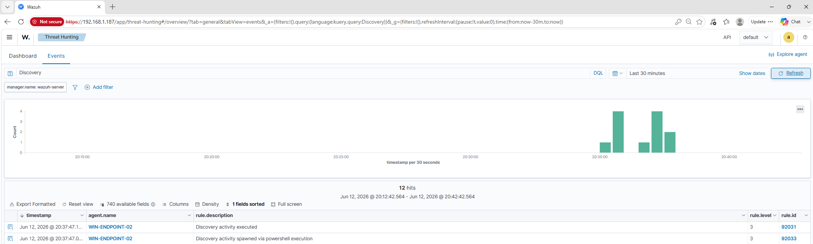
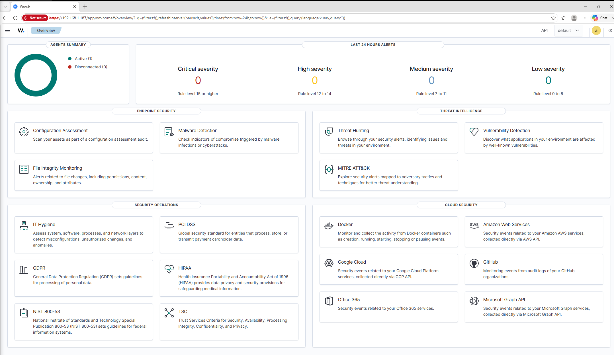
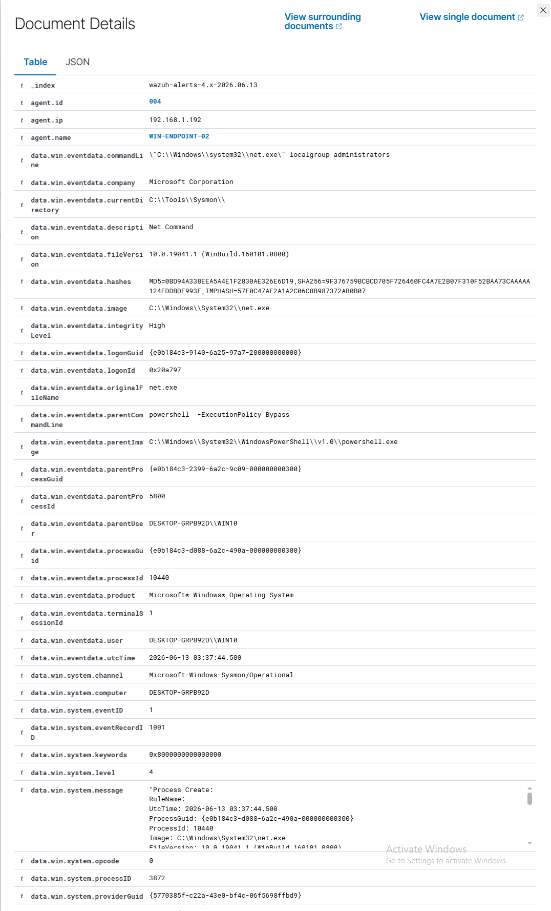
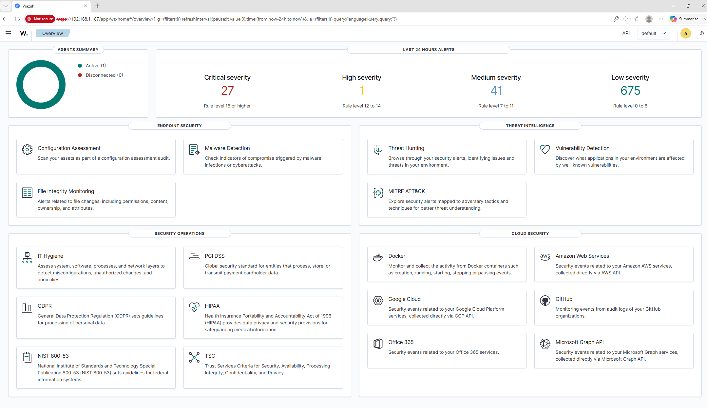

# Wazuh + Sysmon Detection Lab


## Project Overview

This project demonstrates a Windows detection lab built using Wazuh SIEM and Sysmon for endpoint monitoring, log analysis, and threat hunting.

The lab was designed to simulate attacker behavior and validate security detections using centralized logging and Sysmon telemetry.

The environment includes:
- Windows 10 endpoint
- Sysmon event logging
- Wazuh agent integration
- Wazuh manager on Ubuntu
- Threat hunting dashboards
- MITRE ATT&CK aligned detections

## Objectives

- Configure centralized logging with Wazuh
- Integrate Sysmon telemetry
- Simulate attacker techniques
- Detect malicious activity
- Perform threat hunting investigations
- Analyze Windows event logs

## Technologies Used

- Wazuh SIEM
- Sysmon
- Windows 10
- Ubuntu Server
- Filebeat
- PowerShell
- MITRE ATT&CK
- VirtualBox / VMware


## Lab Architecture




## Environment Setup

The lab environment consisted of:
- Ubuntu-based Wazuh server
- Windows 10 endpoint
- Sysmon installed for advanced telemetry
- Wazuh agent configured for centralized log forwarding

Connectivity between systems was verified using:
- Agent status validation
- ICMP connectivity tests
- Wazuh dashboard monitoring

## Attack Simulations

### User Account Creation

A local user account was created using PowerShell to simulate persistence activity.


Command:
```powershell
net user hacker Password123! /add
```



### PowerShell Execution Policy Bypass

PowerShell was launched using execution policy bypass to simulate suspicious script execution behavior commonly observed during attacker activity.

Command:
```powershell
powershell -ExecutionPolicy Bypass
```
Wazuh and Sysmon successfully captured:
- PowerShell process creation
- Parent-child process relationships
- Command-line execution activity
- Threat hunting telemetry


### Discovery and Reconnaissance Activity

Multiple reconnaissance commands were executed to simulate attacker discovery behavior after system compromise.

Commands executed:
```powershell
whoami
net user
net localgroup administrators
systeminfo
tasklist
ipconfig
arp -a
netstat -ano
```

Wazuh generated discovery-related alerts based on Sysmon telemetry and process creation monitoring.



### Suspicious Executable Drop Simulation

A simulated malicious executable named payload.exe was created.

Commands:
```powershell
echo "malware test" > payload.exe
Start-Process .\payload.exe
```

Although the executable was not a valid binary, Sysmon successfully captured:
- File creation activity
- Process execution attempts
- Command-line telemetry
- Suspicious executable behavior


## Detection Results

Wazuh successfully detected:
- PowerShell execution activity
- Discovery and reconnaissance behavior
- User account creation
- Suspicious executable drops
- Sysmon process creation events

Threat hunting was performed using:
- Wazuh dashboards
- Sysmon telemetry
- Rule-based detections
- MITRE ATT&CK mappings

The project demonstrated centralized log collection, endpoint visibility, and Windows event analysis using Sysmon and Wazuh integration.

Alerts were validated through Wazuh threat hunting dashboards and correlated with Sysmon process creation telemetry.

## MITRE ATT&CK Mapping

| Technique ID | Technique |
|---|---|
| T1059 | PowerShell |
| T1087 | Account Discovery |
| T1136 | Create Account |
| T1570 | Lateral Tool Transfer |
| T1036 | Masquerading |

## Key Skills Demonstrated

- SIEM deployment and configuration
- Endpoint monitoring and telemetry collection
- Sysmon log analysis
- Threat hunting and event investigation
- Windows security event analysis
- MITRE ATT&CK mapping
- Detection engineering
- PowerShell activity monitoring
- Security alert triage
- Linux server administration
- Wazuh agent management
- Security dashboard analysis

## Lessons Learned

This project improved understanding of:
- SIEM deployment and management
- Sysmon telemetry analysis
- Windows event logging
- Threat hunting workflows
- Endpoint visibility
- Detection engineering
- MITRE ATT&CK mapping
- Security event analysis

The lab also provided hands-on experience troubleshooting:
- Filebeat configuration
- Wazuh agent communication
- Sysmon event forwarding
- Dashboard indexing and event visibility

## Screenshots

### Wazuh Dashboard


### Threat Hunting Events


### Detection Events

